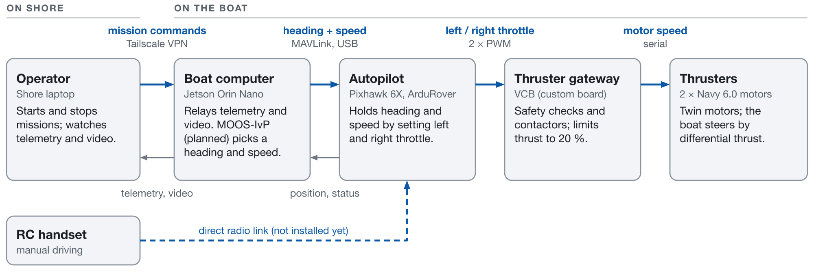

# Project Remora

Boat-side software and documentation for Project Remora, a Highfield RHIB being converted into
an uncrewed surface vehicle (USV) with twin ePropulsion Navy 6.0 electric outboards. This repo
holds the Jetson services, the ArduPilot parameter and log tools, a laptop simulator, and the
hardware notes. On the boat it is checked out at `/home/boat/project-remora`.



## How it fits together

- **Operator (shore laptop).** QGroundControl and a web dashboard, connected to the boat over a
  Tailscale VPN.
- **Boat computer (Jetson Orin Nano).** Shares the autopilot's MAVLink link between
  QGroundControl, the dashboard and, later, MOOS-IvP. It also serves the dashboard and the camera
  video, and logs the battery and the VCB.
- **Autopilot (Pixhawk 6X, ArduRover 4.7).** Navigation plus the speed and turn-rate loops. It
  drives the two thrusters as a skid-steer boat.
- **Thruster gateway (VCB, a custom STM32 board).** Checks the autopilot's two PWM signals, runs
  the contactors and commands the ePropulsion motors. Its firmware lives in a separate repo.

The network and the control layers are drawn in [`docs/figures/`](docs/figures/).

## Status (2026-10-05)

Working:

- Jetson services under systemd: MAVLink router, dashboard, camera stream, battery reader and
  VCB logger.
- ArduRover configured as a boat. The left/right thruster mapping and the VCB's 20 % thrust
  limit were confirmed with the high-voltage bus off on 2026-10-04.
- Parameter, log and inventory tools, with a desired-state parameter file.
- A laptop simulator (ArduPilot SITL) that exposes the same MAVLink endpoints as the boat.

Not done yet:

- No RC receiver is installed, and the RC, ground-station and geofence failsafes are off.
  **Nothing stops the boat on a lost link today. Fix this before it goes in the water.**
- Compass calibration and on-water tuning.
- MOOS-IvP and `iArduRoverBridge` are not installed on the Jetson.
- The VCB runs a bench firmware build: forward thrust only, capped at 20 %, and its source is lost.

## Start here

| Read | For |
|---|---|
| [`docs/figures/`](docs/figures/) | Diagrams of the system, the network and the control layers |
| [`docs/HARDWARE.md`](docs/HARDWARE.md) | What hardware and firmware is on the boat, and how each fact was verified |
| [`docs/VCB_BENCH_FIRMWARE.md`](docs/VCB_BENCH_FIRMWARE.md) | How the VCB arms and starts the thrusters (reverse-engineered), and the operator procedure |
| [`docs/JETSON.md`](docs/JETSON.md) | Jetson runbook: deploy, update, verify, troubleshoot, services and ports |
| [`tools/README.md`](tools/README.md) | Parameter, log and inventory tools, and the tuning-session workflow |
| [`sim/README.md`](sim/README.md) | Running the boat in simulation on a laptop |
| [`params/boat.parm`](params/boat.parm) | The ArduPilot parameters we have decided on, each with its reason |

## Using it

Everything on the boat is reachable only from the team's Tailscale network.

| To | Do |
|---|---|
| Open the dashboard | `http://highfieldboat.tailcacf9.ts.net:8080/` |
| Connect QGroundControl | TCP link to `highfieldboat.tailcacf9.ts.net`, port `5760` |
| Get a shell on the Jetson | `ssh boat@highfieldboat.tailcacf9.ts.net` |
| Run the simulator | `sim/run_sitl.sh` |
| Dump the autopilot's parameters | `tools/ap_inventory.py --params params/$(date +%F).parm` |
| Update the Jetson after a push | `~/project-remora/deploy/update.sh` on the Jetson |

## Repository layout

```
scripts/    Jetson services: gcs.py (dashboard), battery_litime.py (BMS reader), vcb_logger.py.
            battery_rs485.py, battery_teensy.py and bms_probe.py are earlier BMS experiments.
systemd/    Unit files for the five services, and udev rules for /dev/pixhawk and /dev/vcb
config/     mav.conf.new (the mavlink-router config that install.sh deploys),
            mav.conf (the original, kept for reference), cam.yml.example (MediaMTX)
deploy/     install.sh and update.sh for the Jetson, plus logrotate and journald configs
tools/      ArduPilot inventory, parameter, log and bench-check scripts
params/     boat.parm (desired state) and dated parameter dumps
sim/        ArduPilot SITL launcher, parameter overlay and smoke test
firmware/   Flash dump of the VCB bench firmware
docs/       Hardware notes, Jetson runbook, VCB firmware analysis, figures, raw inventories
```

Not tracked: `logs/` and `web/` (captures from the Jetson) and `config/cam.yml`, which holds the
camera password. Use `config/cam.yml.example`.

## Related repositories

- VCB and MCB firmware: https://github.com/cttdev (`VCB`, `MCB`)
- MOOS-IvP missions and `iArduRoverBridge`: the `mCDR-Plume-Tracking` repo
