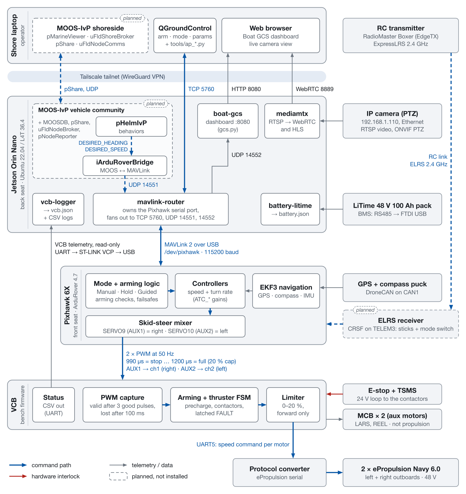
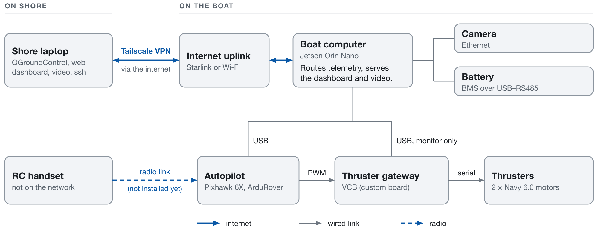
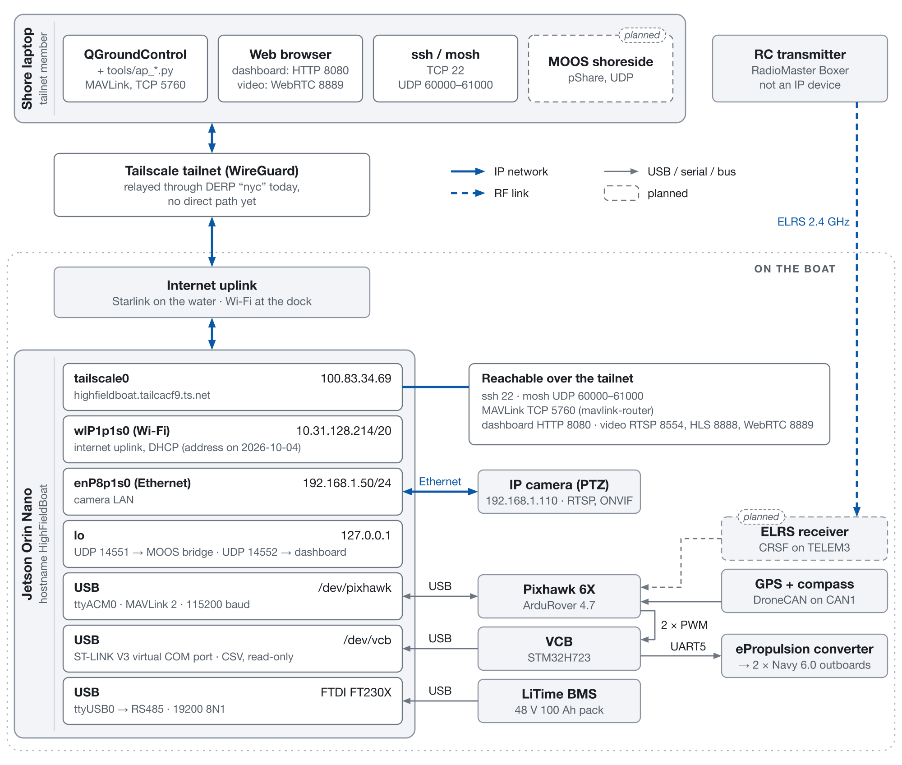
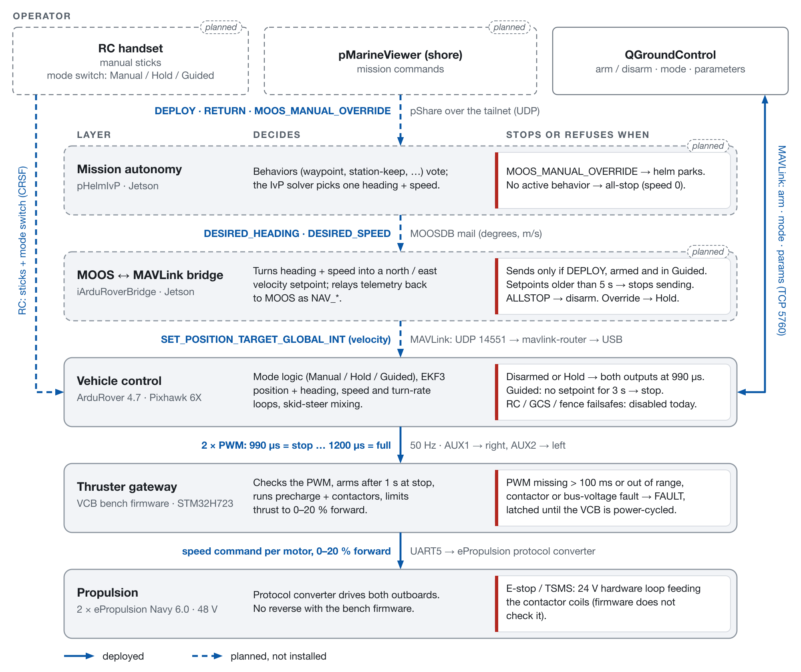

# Figures

Diagrams of the Project Remora software stack, as of 2026-10-05. Dashed boxes and dashed lines
mark things that are planned but not installed yet.

| Figure | Use it for |
|---|---|
| `fig1_system_overview.png` | A first look at the stack |
| `fig1_system_architecture.png` | Reference: every process on every computer, and what it talks to |
| `fig2_network_overview.png` | How the laptop reaches the boat, and what the Jetson is wired to |
| `fig2_network.png` | Reference: addresses, ports and protocols on every link |
| `fig3_control_layers.png` | Reference: what each control layer decides, and what makes it stop |

All five are drawn by [`make_figures.py`](make_figures.py). To change one, edit the text and
coordinates in that script and re-run it; don't edit the images.

```sh
python3 docs/figures/make_figures.py     # needs rsvg-convert (brew install librsvg)
```

## System




## Network





## Control layers


